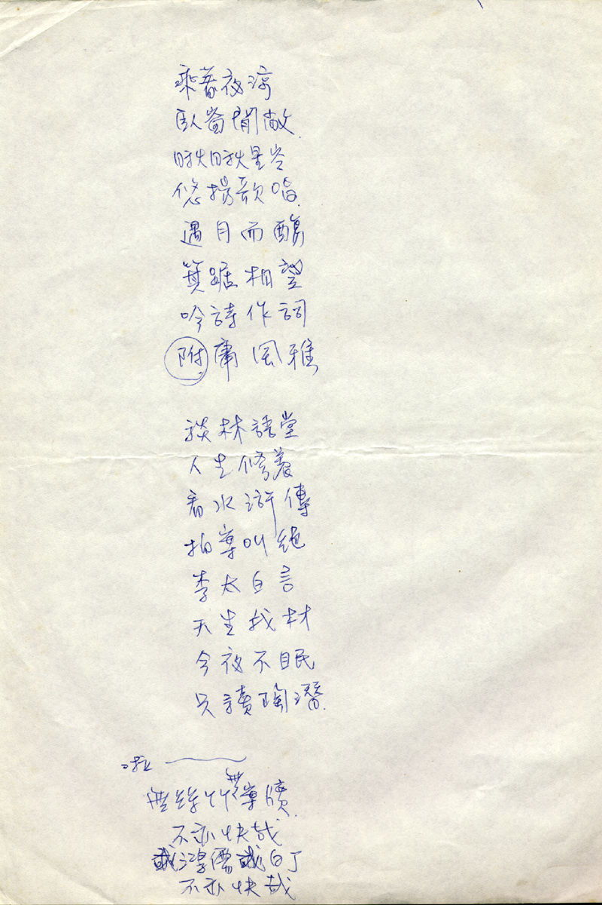

# 不亦快哉

乘着夜凉 
卧窗闲敞 
瞅瞅星空 
悠扬歌唱 
遇月而觞 
箕踞相望 
吟诗作词 
附庸风雅

谈林语堂 
人生修养 
看水浒传 
拍案叫绝 
李太白言 
天生我材 
今夜不眠 
只读陶潜

啦~~~ 
无丝竹无案牍 
不亦快哉 
或鸿儒或白丁 
不亦快哉

当前页面缺陷：创作时间背景未知

## 参考

-   [张雨生手稿 - tieba.baidu.com](https://tieba.baidu.com/p/2084189476#!/l/p1)
