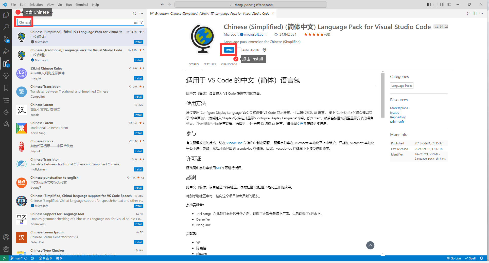
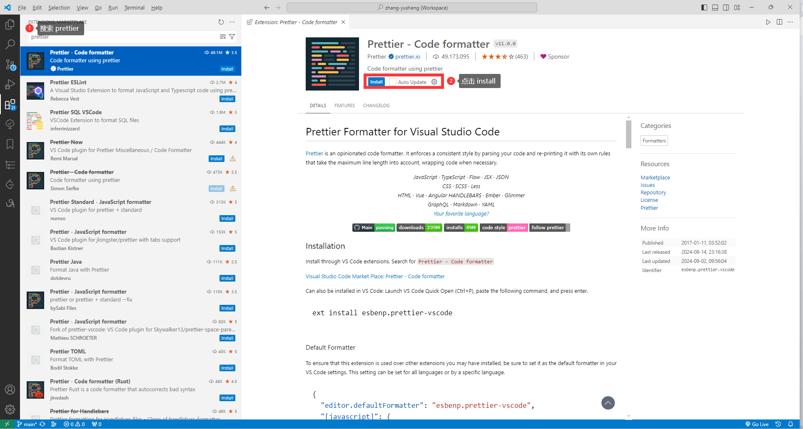
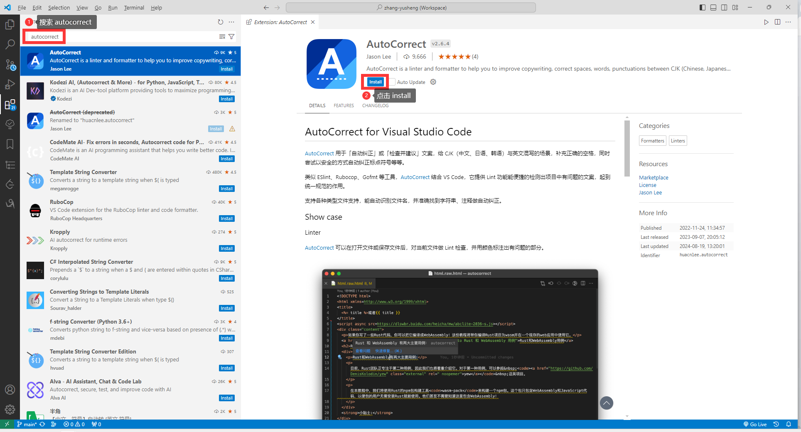
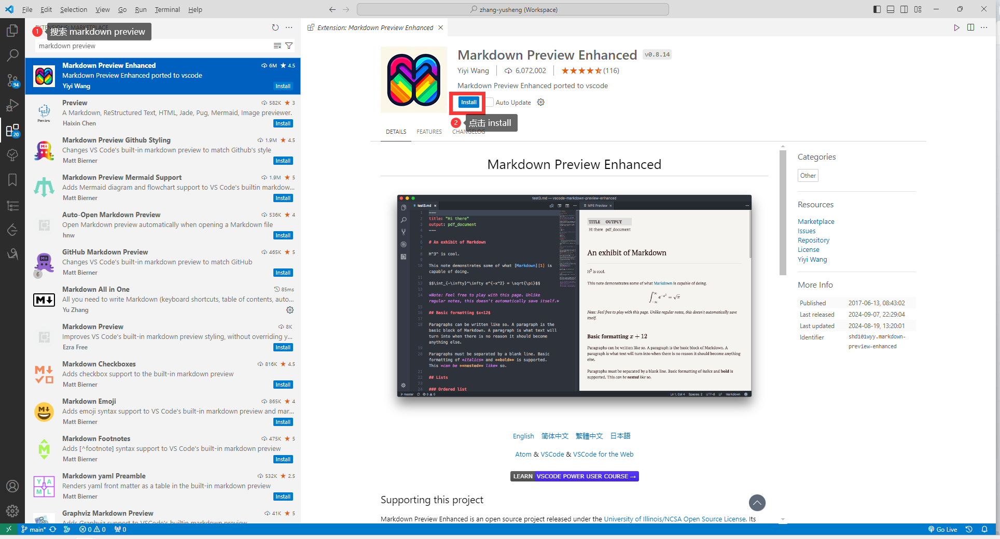
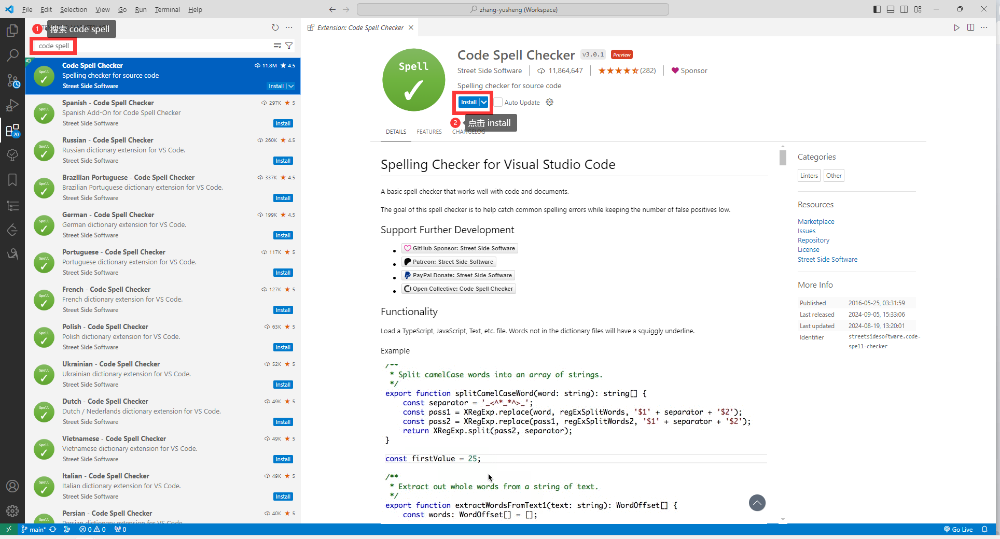
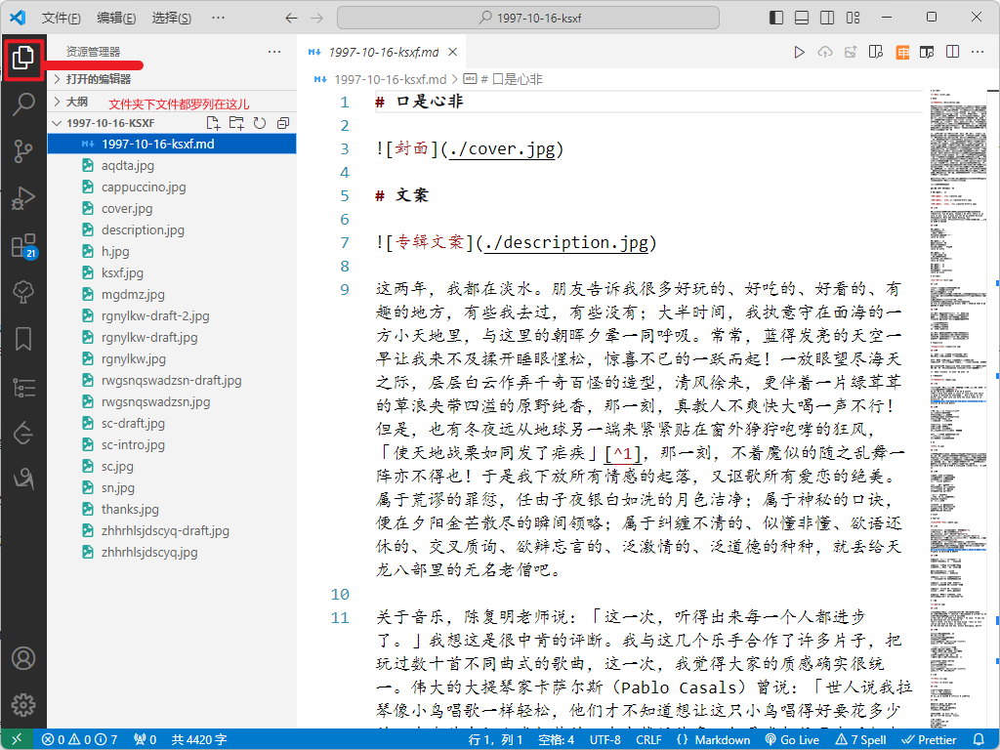
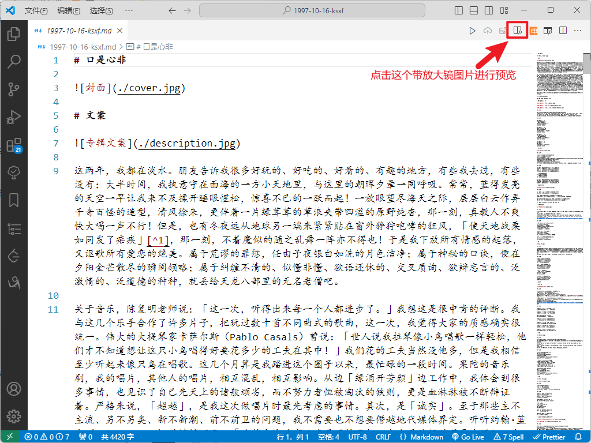
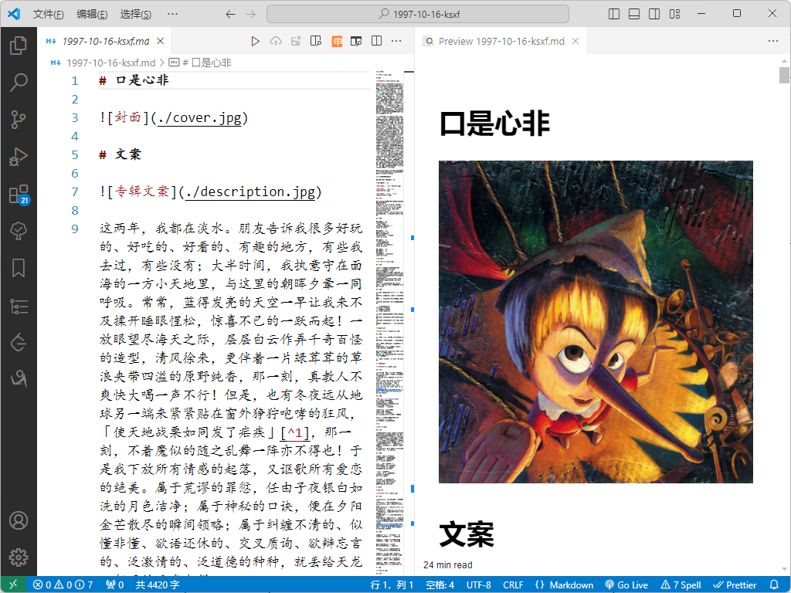
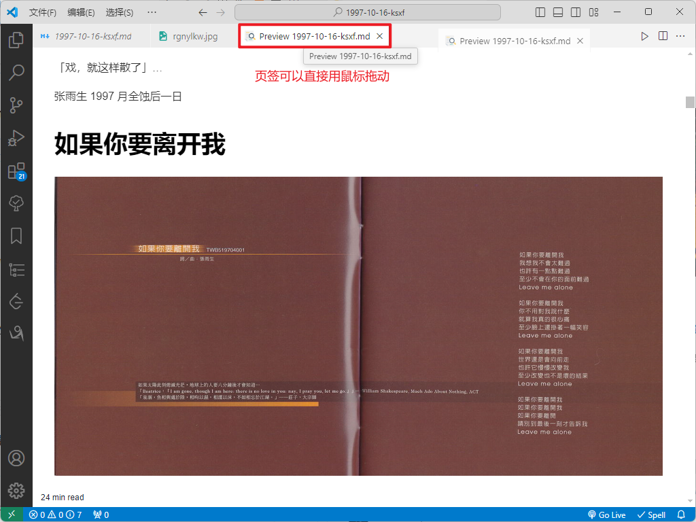

# 资料整理指导

# markdown

目前，所有资料均采用 Markdown 格式编写。

或许有朋友会问，「Markdown」是什么，我不会 Markdown 还能一起整理资料吗？

不必担心，Markdown 是一种标记语言，它的语法简洁明了，不到半小时即可轻松掌握。

[Markdown 官方教程](https://markdown.com.cn/basic-syntax/) 将帮助你掌握这门语言，其中 HTML 相关内容**了解即可**。

# 项目介绍

再次强调，请浏览一遍 [Markdown 官方教程](https://markdown.com.cn/basic-syntax/) 再继续阅读

为了能够更加轻松地理解整个项目的结构，请下载一份网站内容的 [压缩包](https://timaab.lanzouj.com/i3Zce2almbmj) 并解压，结合解压后的文件结构理解项目。

## 目录结构

项目的部分目录结构如下：

```shell
zhang-yusheng.github.io
│  SUMMARY.md
│
├─albums
│  │  albums.md
│  │
│  └─1994-08-xx-kloktbw
│         1994-08-xx-kloktbw.md
│         description.jpg
│         thanks.jpg
│         dwdbg.jpg
│         gdswb.jpg
│         hdj.jpg
│         hzhj.jpg
│
├─articles
│      1994-0x-xx-preface-of-tell-you-the-truth.md
│      articles.md
|
├─performances
│      1992-xx-xx-alpkfwh.md
│      1992-xx-xx-ayxwzgwywh.md
│      performances.md
│
└─shows
       1997-xx-xx-lxhdyyjs.md
       199x-xx-xx-lxhdyyjs.md
       shows.md
```

不同文件夹用于存放不同类型的资料，包括：

-   albums: 专辑
-   articles: 文章
-   letters: 信
-   shows: 综艺
-   performances: 演出

未来可能还会有新的文件夹存放对应资料

## 文件夹和网址的对应关系

`SUMMARY.md` 定义了网站左侧目录的结构，在 `SUMMARY.md` 中通过相对路径引用的 markdown 文件会被发布到网站上。

目前（2024-09-22） `SUMMARY.md` 内容如下：

```md
# Summary

-   [Introduction](README.md)
-   [专辑](./albums/albums.md)
    -   [口是心非](./albums/1997-10-16-ksxf/1997-10-16-ksxf.md)
    -   [口是心非（抛物线版）](./albums/1997-xx-xx-ksxf-parabola/1997-xx-xx-ksxf-parabola.md)
    -   [卡拉 OK·台北·我](./albums/1994-08-xx-kloktbw/1994-08-xx-kloktbw.md)
-   [文章](./articles/articles.md)
    -   [《跟你说真的》序](./articles/1994-0x-xx-preface-of-tell-you-the-truth.md)
-   [综艺](./shows/shows.md)
    -   [199x 龙兄虎弟音乐教室](./shows/199x-xx-xx-lxhdyyjs.md)
    -   [1997 龙兄虎弟音乐教室](./shows/1997-xx-xx-lxhdyyjs.md)
-   [演出](./performances/performances.md)
    -   [1992 奥林匹克风晚会](./performances/1992-xx-xx-alpkfwh.md)
    -   [1992 奥运希望之光文艺晚会](./performances/1992-xx-xx-ayxwzgwywh.md)

```

## 命名约定

因为电子书打包工具不支持中文文件名，所以所有的文件和文件夹名称都**必须是英文**。

文件名只能使用**小写字母**、数字和减号。

### 文件夹

文件夹的名称应当为复数形式或缩写，如 albums、articles、music-videos 或 mv。

### 资料

「资料」指的是具有明确的发布或创作时间的一个文件。如《口是心非》专辑、雨生 1997 年参加的一次龙兄虎弟音乐教室。

资料文件名格式为 `创作时间-资料名.md`，时间不知道的用小写英文字母 `x` 表示。  
目前项目采用的文件名格式有两种：

1. `年-月-日-资料中文拼音首字母拼接.md`，适用于不知道如何翻译资料以及资料的名称太长的情况。  
   如 `1997-10-16-ksxf.md` 表示 1997 年 10 月 16 日发行的专辑《口是心非》的内容。
2. `年-月-日-资料名英文.md`，适用于资料非常好翻译为英文的情况。  
   如 `1994-0x-xx-preface-of-tell-you-the-truth.md`，表示 1994 年某月某日雨生为《跟你说真的》这本书写的序。

在 `albums` 文件夹中，统一使用第一种文件名格式。

### 图片

目前（2024-09-22）只在专辑部分使用图片，统一使用汉语拼音首字母拼接命名。

如《如果你要离开我》的专辑图片，命名为 `rgnylkw.jpg`，而不是 `if-you-want-to-leave-me.jpg`

## 结构约定

当一份资料需要引用各种多媒体素材（如图片、音频）时，需要建立一个**与资料名称相同的文件夹**，将 markdown 文件和所引用的素材放到同一个文件夹内。

如专辑《口是心非》的所有素材都放在 `albums/1997-10-16-ksxf` 文件夹内。

这样的好处是，未来如果要迁移资料，可以直接移动整个文件夹。

# 发布新资料

目前投递资料到网站有如下两种方法：

1. 通过邮件将整理好的资料发送给 `zhang-yusheng@qq.com`，注明要发布到的类别，是专辑，还是演出……
2. 注册一个 GitHub 账号，fork 本[仓库](https://github.com/zhang-yusheng/zhang-yusheng.github.io)后，在自己的仓库下进行编辑，然后通过 pull request 进行更新。

站长有空时就会手动将新资料合入网站

# 编辑器配置

## 安装 Visual Studio Code 和插件

这里我们选择使用 Visual Studio Code（简称 vscode）作为 markdown 文件的编辑器。

从 [Visual Studio Code 官方网站](https://code.visualstudio.com/) 下载并安装 vscode，安装过程中所有配置保持默认。

打开 vscode，在侧边栏的插件市场中搜索并安装如下插件：

-   Chinese (Simplified)
    
-   prettier
    
-   markdown all in one
    
-   autocorrect
    
-   markdown preview enhanced
    
-   code spell checker
    

# vscode 使用

配置好 vscode 编辑器后，就可以开始编写资料了。  
这里用我已经整理好的《口是心非》专辑作为例子，从 [《口是心非》资料整理](https://timaab.lanzouj.com/iGmJo2ayuada) 下载压缩包并解压，然后打开 vscode。

## 编辑文件和打开文件夹

点击左上角「文件」后，可以选择「新建文本文件」或「打开文件夹」。


我们打开解压后的文件夹，名称为 `1997-10-16-ksxf`，侧边栏的「资源管理器」中可以看到文件夹下的文件，点击对应的文件可以浏览。



## 格式化文件

打开 `1997-10-16-ksxf.md` 文件，我们按下 `Alt + Shift + F`  
如果提示需要指定格式化插件（formatter），选择 prettier，千万不要选择 Markdown All in One。

`Alt + Shift + F` 将格式化正在编辑的 markdown 文件，比如连续多个空行将被替换为一个空行，列表的缩进将统一……

## 预览文件

点击右上角放大镜对文件进行预览



下面是预览效果：



就像谷歌浏览器里的每个标签页那样，在 vscode 中，所有打开的页签都是可以拖动的。


## 检查拼写错误单词

点击下方状态栏中 圆圈里有个 i 的图标，可以检查拼写错误


## 编辑 `1997-10-16-ksxf.md`

现在你应该已经掌握了 Markdown 语法和 vscode 编辑器的使用，  
试着编辑 `1997-10-16-ksxf.md` 下吧，比如修改标题、插入一些其他的图片、添加自己的脚注等待，  
所有的改动都可以通过点击右上角的放大镜图标预览。

# Commit Comment 约定

该部分只需 GitHub Collaborators 阅读。

| 类型     | 说明                                       |
| :------- | :----------------------------------------- |
| feat     | 为项目**增加**内容，如添加出处、添加脚注等 |
| fix      | 修订项目中**错误**的部分，如笔误、时间等   |
| refactor | 重命名项目、移动项目                       |
| style    | 文件**格式**修改                           |
| chore    | 网站部署相关的修改                         |
