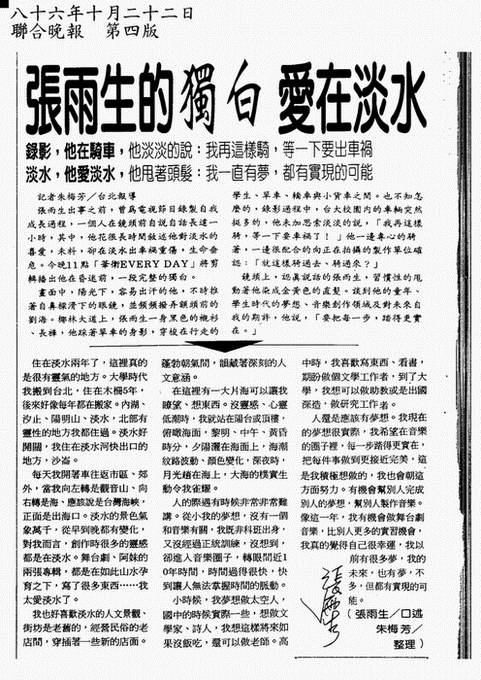

# 张雨生的独白 爱在淡水

录影，他在骑车，他淡淡的说：我再这样骑，等一下要出车祸  
淡水，他爱淡水，他甩着头发：我一直有梦，都有实现的可能

> 记者朱梅芳 / 台北报导
>
> 张雨生出事之前，曾为电视节目录制自我成长过程，一个人在镜头前自说自话长达一小时，其中他花很长时间叙述他对淡水的喜爱，未料，却在淡水出车祸重伤，生命垂危。今晚 11 点，「华卫 EVERY DAY」将剪辑播出他在昏迷前，一段完整的独白。
>
> 画面中，阳光下，容易出汗的他，不时推着自鼻梁滑下的眼镜，并频频拨弄额头前的刘海。椰林大道上，张雨生一身黑色的衬衫、长裤，他踩着单车的身影，穿梭在行走的学生、单车、轿车与小货车之间。也不知怎么的，录影过程中，台大校园内的车辆突然挺多的，他未加思索淡淡的说，「我再这样骑，等一下要车祸了！」他一边专心的骑着，一边很配合的向正在拍摄的制作单位确认：「就这样骑过去、骑过来？」
>
> 镜头上，认真说话的张雨生，习惯性的甩动着他染成金黄色的直发。谈到他的童年、学生时代的梦想、音乐创作领域及对未来自我的期许，他说，「要把每一步，踏得更实在。」

住在淡水两年了，这里真的是很有灵气的地方。大学时代我搬到台北，住在木栅 5 年，后来好像每年都在搬家。内湖、汐止、阳明山、淡水，北部有灵性的地方我都住过。淡水好开阔，我住在淡水河快出口的地方，沙仑。

每天我开着车往返市区、郊外，当我向左转是观音山、向右转是海、应该说是台湾海峡，正面是出海口。淡水的景色气象万千，从早到晚都有变化，对我而言，创作时很多的灵感都是在淡水。舞台剧、阿妹的两张专辑，都是在如此山水孕育之下，写了很多东西……我太爱淡水了。

我也好喜欢淡水的人文景观、街坊是老旧的，经营民俗的老店间，穿插着一些新的店面。蓬勃朝气间，蕴藏着深刻的人文意涵。

在这里有一大片海可让我瞭望、想东西。没灵感、心灵低潮时，我就站在阳台或顶楼，俯瞰海面，黎明、中午、黄昏时分，夕阳洒在海面上，海潮纹路波动、颜色变化，深夜时，月光趟在海上，大海的朴实生动令我雀跃。

人的际遇有时候非常非常难讲。从小我的梦想，没有一个和音乐有关，我既非科班出身，又没经过正统训练，没想到，却进入音乐圈子，转眼间近 10 年时间，时间过得很快，快到让人无法掌握时间的脉动。

小时候，我梦想做太空人，国中的时候实际一些，想做文学家、诗人，我想这样将来如果没饭吃，还可以做老师。高中时，我喜欢写东西、看书，期盼做个文学工作者，到了大学，我想可以当个助教或是出国深造，做研究工作者。

人还是应该有梦想。我现在的梦想很实际，我希望在音乐的圈子里，每一步踏得更实在，把每件事做到更接近完美，这是我积极想做的，我也会朝这方面努力。有机会帮别人完成别人的梦想，帮别人制作音乐。像这一年，我有机会做舞台剧音乐，比别人更多的实习机会，我真的觉得自己很幸运，我以前有很多梦，我的未来，也有梦，不多，但都有实现的可能。

<iframe src="https://player.bilibili.com/player.html?isOutside=true&aid=47808797&bvid=BV1Kb411s7JY&cid=83744041&p=1&high_quality=1&danmaku=0&autoplay=0" allowfullscreen="allowfullscreen" width="100%" height="500" scrolling="no" frameborder="0" sandbox="allow-top-navigation allow-same-origin allow-forms allow-scripts"></iframe>

<iframe src="https://player.bilibili.com/player.html?isOutside=true&aid=37871735&bvid=BV1pt411q7ES&cid=66578303&p=1&high_quality=1&danmaku=0&autoplay=0" allowfullscreen="allowfullscreen" width="100%" height="500" scrolling="no" frameborder="0" sandbox="allow-top-navigation allow-same-origin allow-forms allow-scripts"></iframe>

# 参考

相关链接：

-   [张雨生剪报海报等收藏 - tieba.baidu.com](https://tieba.baidu.com/photo/p?kw=%E5%BC%A0%E9%9B%A8%E7%94%9F&tid=2084189445&pic_id=ab24bc315c6034a810ea909bcb134954092376a4)
-   [爱在淡水 - tomchang.cn](https://www.tomchang.cn/archive/article/57.html)

整理：momo，健健

当前页面缺陷：

1. 待校对
2. 采访时间未知
